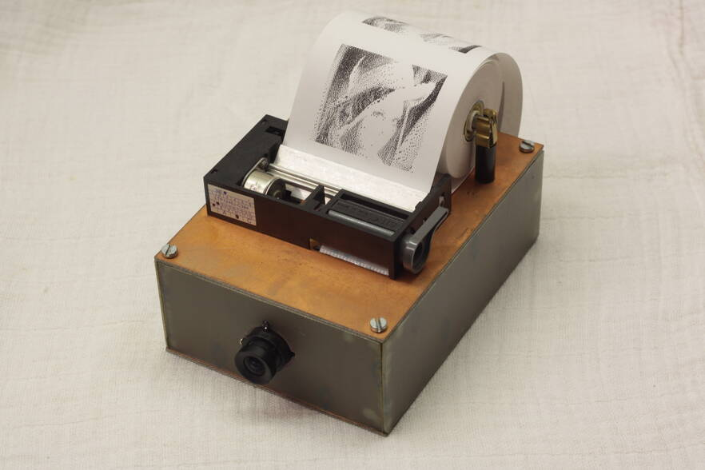

This is the firmware for a simple thermocromic selfie camera based on

- A OV7670 camera module (without FIFO),
- A STM32F103C8T6 microcontroller, and
- A LTP1245 thermal printer module.

Apart from that, only a level shifter for the thermal printer (which needs 5 V signals), a motor driver for its stepper, a pullup for its thermistor, and a MOSFET for turning all power off are needed.

If an SD-card is connected, all photos are also stored there as 2-colour (dithered) BMP files.

More details can be found [here](https://25120.org/post/inverse_thermal_camera/).

## Licence

The device header files in the `third_party` directory are provided by ARM Limited and ST Microelectronics and contain their own licence information. FatFs, also located in `third_party`, contains its own licence information as well. Everything else is ISC licenced.
